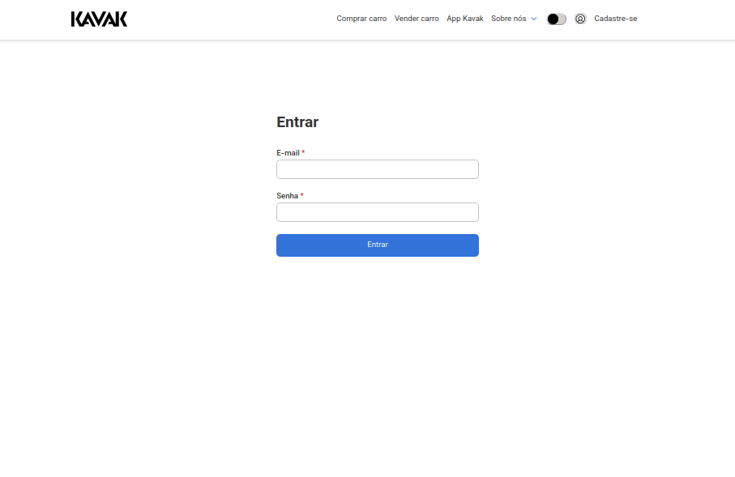
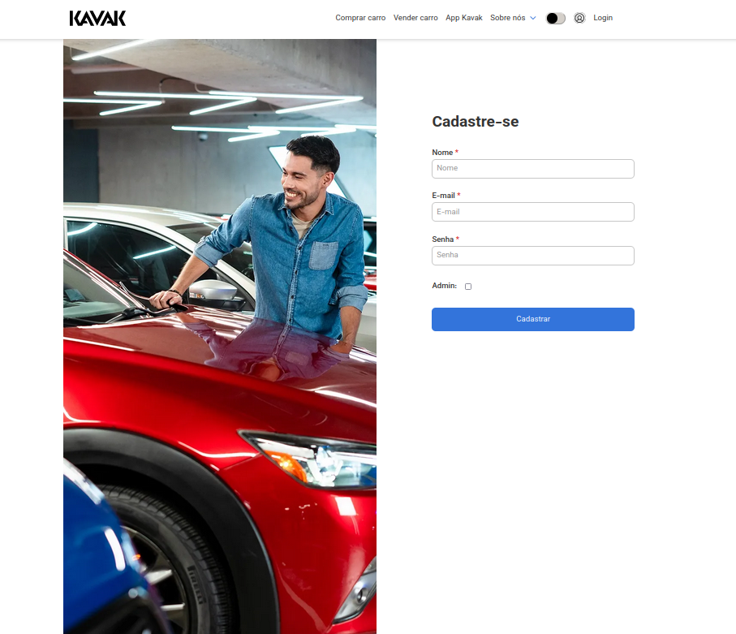
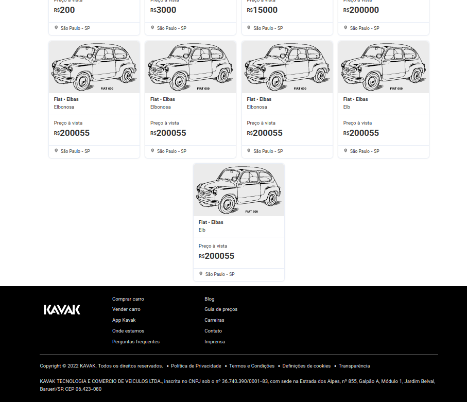
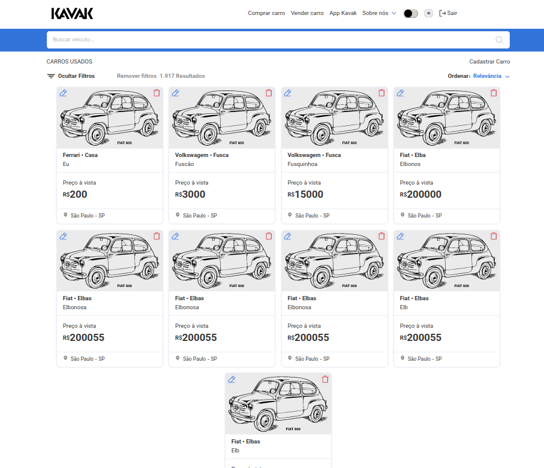
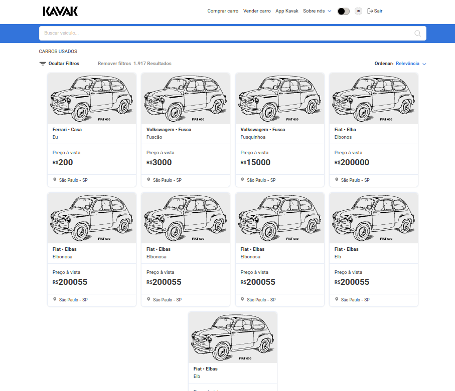

# ✨ **Catálogo de Veículos Verzel - Frontend**

<center>

### [Rodando Localmente](#🏡-rodando-localmente) ▪️ [Funcionalidades](#📚-funcionalidades) ▪️ [Tecnologias](#🚀-tecnologias) ▪️ [Imagens do App](#📸-imagens-do-app)

</center>

## Acesse os Repositórios do Projeto

### [FRONTEND REPOSITORY](https://github.com/igorjba/verzel-front)
### [BACKEND REPOSITORY](https://github.com/igorjba/verzel-back)

<br />

## 🏡 **Rodando localmente**

<details>
<summary><strong>Passo a Passo para Rodar o Projeto</strong></summary>
<br />

1. **Clone o repositório**
   ```bash
   git clone git@github.com:igorjba/verzel-front.git
   ```
2. **Entre no diretório do projeto**
   ```bash
   cd verzel-front
   ```
3. **Instale as dependências**
   ```bash
   npm install
   # ou
   yarn
   ```
4. **Inicie o projeto**
   ```bash
   npm run dev
   # ou
   yarn dev
   ```
5. **Acesse via navegador**
   Abra `http://localhost:3000` no seu navegador.
</details>

<br />

## 📚 **Funcionalidades**

<details>
<summary><strong>Funcionalidades Disponíveis no Frontend</strong></summary>

- **Autenticação e Registro**: Gerenciamento de acesso de usuários.
- **Listagem de Veículos**: Visualização dos veículos disponíveis.
- **Gerenciamento de Veículos**: Adição, edição e remoção de veículos.
- **Pesquisa**: Busca avançada por veículos.
- **Interface Flexível**: Acessível em diversos dispositivos.
</details>

<br />

## 🚀 **Tecnologias**

<details>
<summary><strong>Tecnologias Utilizadas no Frontend</strong></summary>

- **React**: Para construção de interfaces dinâmicas.
- **Styled Components**: Estilização dos componentes.
- **Axios**: Para requisições HTTP.
- **React Router Dom**: Gerenciamento de rotas.
- **Vite**: Ferramenta de build moderna e eficiente.
</details>

<br />

## 📸 **Imagens do App**

<details>
<summary><strong>Tela de Login</strong></summary>



Descrição: Interface de login para acesso ao sistema.
</details>

<details>
<summary><strong>Tela de Cadastro</strong></summary>



Descrição: Página para registro de novos usuários.
</details>

<details>
<summary><strong>Dashboard - Visualização sem Login (Header)</strong></summary>


Descrição: Visão do dashboard sem estar logado, mostrando o cabeçalho.
</details>

<details>
<summary><strong>Dashboard - Visualização sem Login (Footer)</strong></summary>



Descrição: Visão do dashboard sem estar logado, mostrando o rodapé.
</details>

<details>
<summary><strong>Dashboard - Usuário Admin</strong></summary>



Descrição: Interface do dashboard quando logado como usuário administrador.
</details>

<details>
<summary><strong>Dashboard - Usuário Comum</strong></summary>



Descrição: Interface do dashboard quando logado como usuário comum.
</details>

<br />

---

README criado com 💙 por [Igor Bahia](https://www.linkedin.com/in/igor-bahia-31b7b06b/)

---
